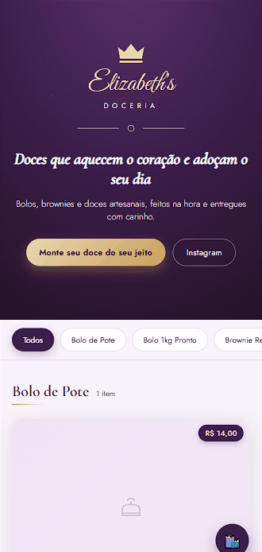

# 👑 Elizabeth's Doceria

Uma plataforma elegante e funcional para uma doceria artesanal, desenvolvida com foco em experiência do usuário e gerenciamento inteligente de produtos.

  

---

## 🎥 Demonstração em Vídeo

Assista como o site funciona:



---

## ✨ Funcionalidades

### 🛍️ Loja Frontend
- **Catálogo dinâmico**: Produtos organizados por categorias (Bolos, Brownies, Doces Especiais)
- **Sistema de customização**: Monte seu próprio doce escolhendo sabor, tamanho e ingredientes
- **Carrinho de compras**: Adicione/remova produtos com atualização em tempo real
- **Integração WhatsApp**: Envie pedidos direto para o número da doceria
- **Responsivo**: Design adaptado para mobile e desktop
- **Design elegante**: Interface sofisticada com tema roxo/ouro

### 👨‍💼 Painel Administrativo
- **Gerenciamento de produtos**: Criar, editar e deletar bolos e doces
- **Cadastro de categorias**: Organizs produtos por seção
- **Galeria de fotos**: Upload de até 4 imagens por produto
- **Controle de preços**: Gerenciamento dinâmico de valores
- **Sistema de autenticação**: Painel protegido com senha

### 📱 Integração Social
- **Links do Instagram**: Acesso direto ao perfil
- **Botão WhatsApp**: Pedidos com mensagem automática
- **Compartilhamento**: Fácil divulgação de produtos

---

## 🛠️ Tecnologias Utilizadas

```
Frontend:
  • HTML / CSS
  • Vanilla JavaScript (ES6+)
  • Design Responsivo

Backend & Database:
  • Firebase Firestore (Banco de Dados em Tempo Real)
  • Firebase Authentication

Design & UX:
  • Google Fonts (Cormorant Garamond, Great Vibes, Jost)
  • SVG Icons & Illustrations
  • CSS Custom Properties (Variáveis)
```

---

## 📋 Como Usar

### 🔧 Configuração Local

1. **Clone o repositório**
   ```bash
   git clone https://github.com/seu-usuario/elizabeths-doceria.git
   cd elizabeths-doceria
   ```

2. **Configure o Firebase**
   - Crie um projeto no [Firebase Console](https://console.firebase.google.com)
   - Obtenha suas credenciais
   - Edite o arquivo `firebase-init.js` com suas credenciais

   ```javascript
   // firebase-init.js
   const firebaseConfig = {
     apiKey: "YOUR_API_KEY",
     authDomain: "your-app.firebaseapp.com",
     projectId: "your-project-id",
     storageBucket: "your-storage-bucket",
     messagingSenderId: "your-sender-id",
     appId: "your-app-id"
   };
   ```

3. **Abra no navegador**
   - **Site da loja**: Abra `index.html` no navegador
   - **Painel admin**: Acesse `admin.html`

### 🌐 Usando o Site

**Na página inicial:**
- Navegue pelo catálogo de produtos
- Clique em "Monte seu doce do seu jeito" para customizar
- Adicione ao carrinho
- Envie o pedido via WhatsApp

**No painel admin:**
- Acesse com a senha configurada
- Adicione novos produtos com fotos
- Edite preços e descrições
- Organize por categorias

---

## 📁 Estrutura do Projeto

```
elizabeths-doceria/
├── index.html              # Página principal da loja
├── admin.html              # Painel administrativo
├── store.js                # Lógica principal da loja
├── admin.js                # Lógica do painel admin
├── firebase-init.js        # Configuração Firebase
├── style.css               # Estilos globais
├── img/                    # ícones
├── video-readme/           # Vídeo demonstrativo do projeto
└── README                  # Este arquivo
```


## 🎨 Design & Estilo

O projeto apresenta uma identidade visual premium com:
- **Paleta de cores**: Roxo lavanda, ouro elegante e tons suaves
- **Tipografia**: Fontes sofisticadas do Google Fonts
- **Componentes**: Cards de produtos, modais customizados, toasts de notificação
- **Animações**: Transições suaves e interações fluidas

---

## 💡 Destaques do Desenvolvimento

✅ **Banco de dados em tempo real** - Sincronização instantânea de produtos  
✅ **Interface intuitiva** - UX pensada para vendas  
✅ **Totalmente responsivo** - Funciona perfeitamente em qualquer dispositivo  
✅ **Sem backend customizado** - Serverless com Firebase  
✅ **Fácil de manter** - Código organizado e bem estruturado  

---


## 📝 Licença

Projeto de portfólio - Sinta-se livre para usar como inspiração ou referência.

---

**Desenvolvido com ❤️ para Elizabeth's Doceria**

